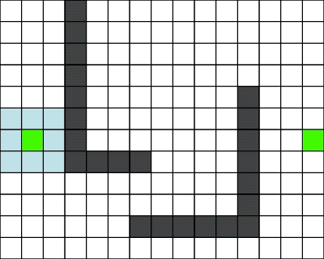

path-finding-visualizer
=======================

一个用来可视化最短路算法的小工具.

### 运行结果

| <!-- -->                               | <!-- -->                         |
| -------------------------------------- | -------------------------------- |
| dijkstra:        | A*:           |
| flow-field:    | LPA*:       |

### 本地执行

先确保已安装 [conan](https://conan.io/), 然后执行以下来安装依赖:

```bash
make install
```

然后构建:

```bash
make configure
make build
```

接下来, 查看帮助:

```
./build/path-finding-visualizer --help
```

一个运行 `A*` 算法的例子:

```
./build/path-finding-visualizer --start 6,1 --target 6,14 astar
```

目前支持的算法:

* `dijkstra`
* `dijkstra-bi` (双向 dijkstra)
* `astar` (`A*` 算法)
* `astar-bi` (双向 `A*` 算法)
* `flow-field` 简单的流场寻路
* `lpastar` (`LPA*` 算法, 一种增量计算的 `A*` 算法,  [Lifelong Planning A*](https://en.wikipedia.org/wiki/Lifelong_Planning_A*) )

#### 操作说明:

1. 按下 `ESC` 或者 `Ctrl-C` 来退出.
2. 按下 `Ctrl-S` 来手动截图, 会保存在 `screenshots` 目录, 也可以用 `--enable-screenshot` 来对每一帧自动截图 (会自动在找到最短路后及时退出自动截图, 免得截图太多).
3. 单击鼠标左键, 来翻转一个地图方格(成为障碍物或者消去障碍物), 引起重新计算 (`lpastar` 支持增量寻路, 不会全部重算).
4. 单击鼠标右键, 变更起始点 (`flow-field` 流场可以在目标不变的情况下, 直接计算多个出发点的路径).

#### 地图

1. 地图规格 `12x15`, 0 表示空白, 1 表示障碍物
2. 地图文件默认在当前目录 `map.txt`
3. 默认是支持 8 个方向移动 (使用选项 `-d4` 来只使用四个方向).
4. 代价: 水平和垂直方向移动消耗 `10`, 对角方向移动消耗 `14` (根号2 倍).

#### 颜色说明

1. 黑色: 障碍物
1. 浅蓝色: 待扩展的方格, 也常叫做 `open_list`, `open_set`, 或者优先级队列中的元素
1. 深蓝色: 已经探索过的方格 (也常叫做 `closed_list`, `closed_set`, visited 数组)
1. 绿色: 起点, 终点都是绿色. 探索到的最短路径是绿色
1. 红色边框: 鼠标修改过此位置

### 其他

字体 `Arrows.ttf` 来自 https://www.dafont.com/arrows.font.
